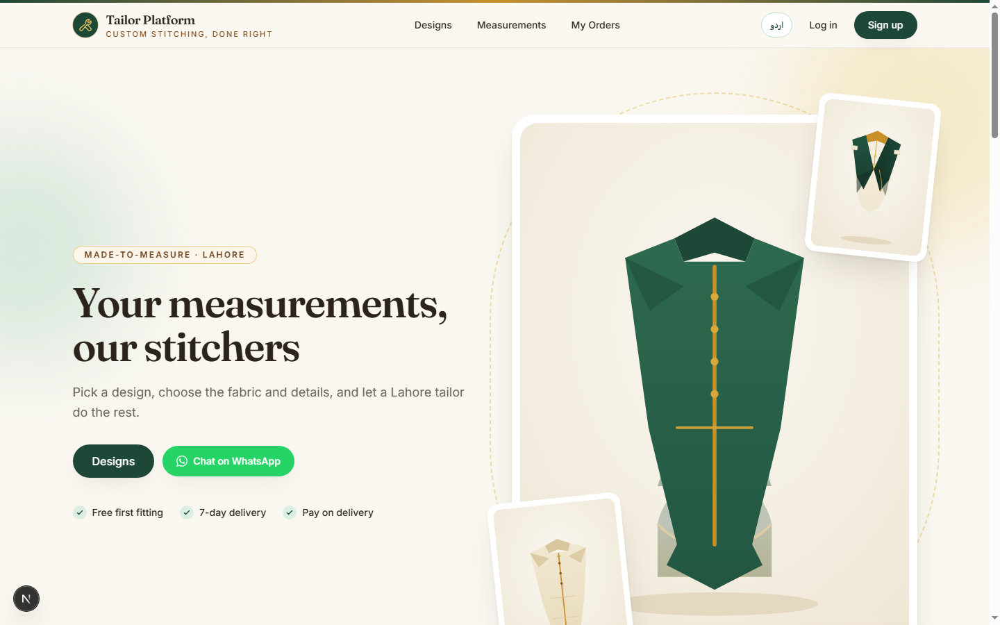
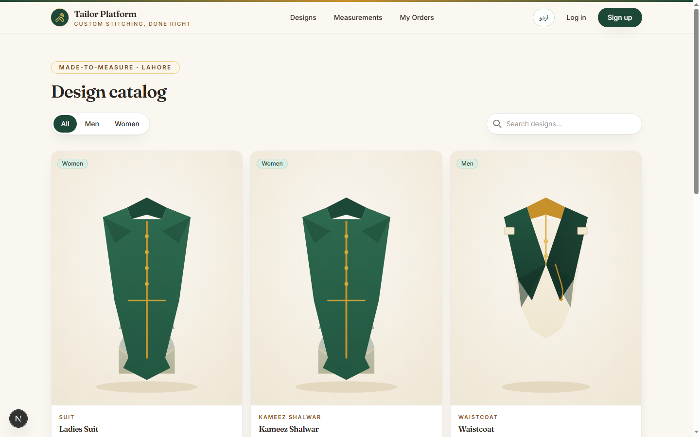
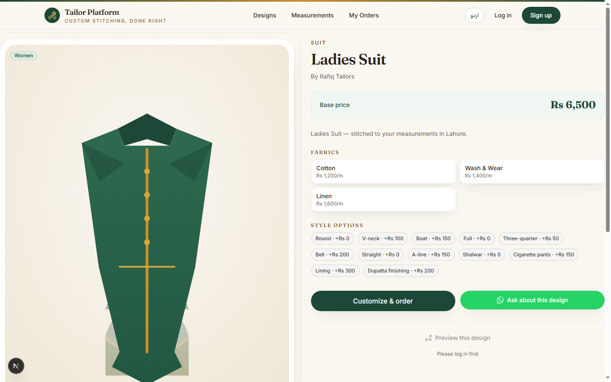
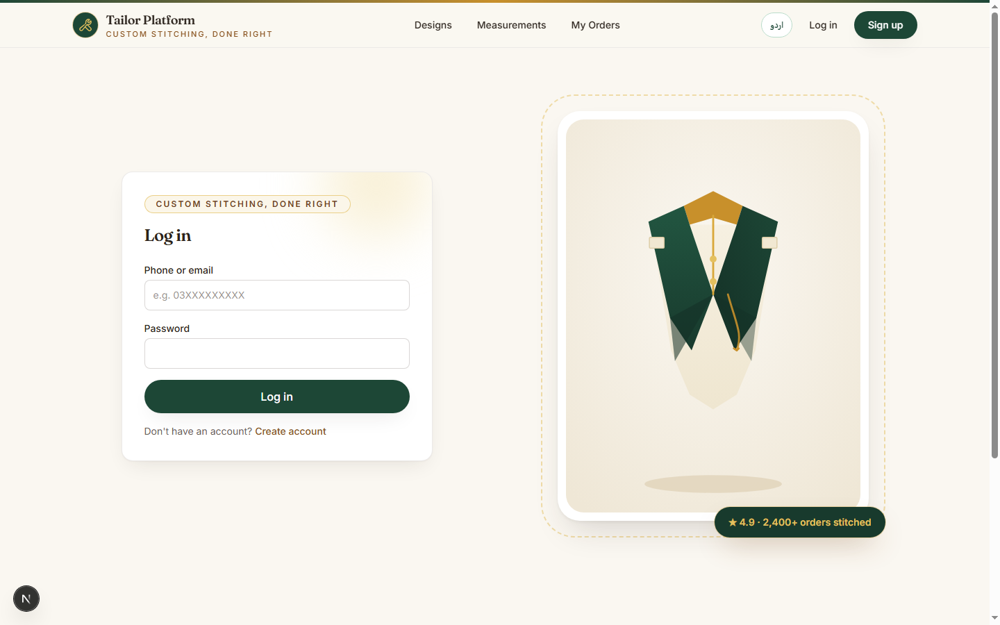

# Tailor Platform

A local tailor website for Lahore: browse the design catalog, get custom
stitching orders with customer price offers, keep measurements on file, and
manage everything from a tailor dashboard. Phase 1 is a working ordering
business (no AI); Phase 2 stubs out AI Style Preview with a graceful 501.

<table>
<tr>
<td><strong>Home</strong> — brand story, featured designs, how-ordering-works</td>
<td></td>
</tr>
<tr>
<td><strong>Catalog</strong> — designs with pricing, filters and Style Preview</td>
<td></td>
</tr>
<tr>
<td><strong>Design detail</strong> — fabrics, stitching options, reviews, preview</td>
<td></td>
</tr>
<tr>
<td><strong>Login</strong> — customers and tailors sign in with phone + password</td>
<td></td>
</tr>
</table>

## How it works

1. **Browse the catalog** — men's and women's designs (Shalwar Kameez, Kurta,
   Waistcoat, Suits) with base prices and fabric options.
2. **Customize & order** — pick a fabric and stitching options, add your saved
   measurements, and optionally **propose your own price** as a non-binding
   offer. The shop confirms the final price before stitching starts.
3. **Track status** — orders move through a locked flow:
   `PLACED → ACCEPTED → MEASUREMENTS_CONFIRMED → STITCHING → QUALITY_CHECK → READY → DELIVERED`
   (plus `CANCELLED` before delivery).
4. **Tailor dashboard** — accept orders, counter price offers, update
   measurements and stitching status, and manage the design catalog.
5. **Review after delivery** — customers rate and review their finished order.

## Tech stack

| Layer    | Tech                                                       |
| -------- | ---------------------------------------------------------- |
| Frontend | Next.js 15 (App Router, TS) + Tailwind CSS 4 + Zustand 5   |
| Backend  | Express 5 (TS) + Prisma 6 + PostgreSQL 16                  |
| Tests    | Backend: Jest 30 + Supertest · Frontend: Vitest 5 + RTL 16 |
| Tooling  | npm workspaces, Prettier, ESLint 9 (flat config), Docker   |

## Getting started

```bash
npm install            # root, installs both workspaces
npm run db:up          # start Postgres (docker)
npm run db:migrate     # prisma migrate dev
npm run db:seed        # demo tailor + designs
npm run dev            # backend :4000 + frontend :3000
npm test               # backend Jest + frontend Vitest
npm run lint           # ESLint both workspaces
npm run typecheck      # tsc --noEmit both workspaces
```

Demo logins: tailor `03001234567` / `password123`, customer `03007654321` / `password123`.

## Notes

- Money is PKR, computed and stored server-side (frontend mirrors for display only).
- UI is bilingual (English + Urdu, RTL-aware).
- API contract: [`docs/api-contract.md`](docs/api-contract.md).
- Product plan: [`PRODUCT-PLAN.md`](PRODUCT-PLAN.md).

sma`, `postgresql`, `typescript`, `tailwindcss`, `zustand`, `ecommerce`, `custom-tailoring`
